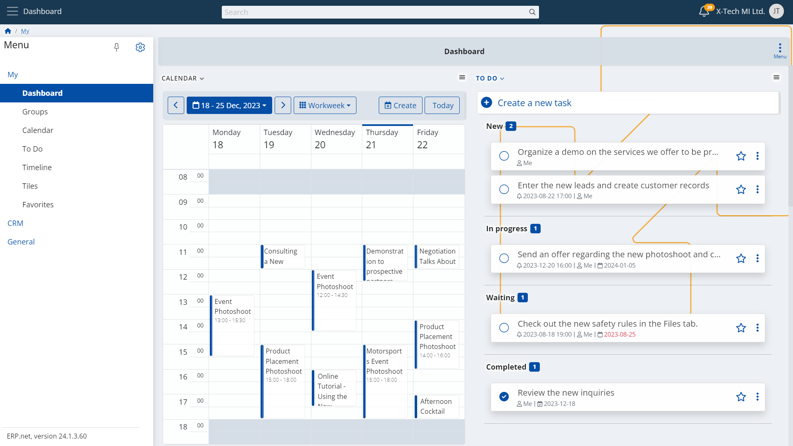

# Dashboard

## Overview

Oftentimes in today's business environment, we **take on many roles and responsibilities** and, respectively, **carry out all kinds of tasks and actions**. 
Many experts, managers, and creators are **adept to work in multiple areas, professional fields, and industries**.  

The comprehensiveness and scope of our work **requires our attention and eye for detail at so many places**. 
This can have us **going back and forth**, **navigating through** various modules, apps, and panels, **searching for** information and continuously **checking for** something.  

What if, instead of dashing raipidly through here and there, we had **a single location that greets us** everytime we access our business management platform? 
A **spot that contains everything we need in a simple, yet effective form**, allowing us to **review the things that matter the most**, in a quick look. 
Something that we can **personalize to suit it perfectly to every role we and our team members decide to take** for the projects and assignments we face ahead.  

The @@name platform has a definite answer to this with your **Dashboard**:  

  

## Dashboard in @@name

**The Dashboard in @@name** is the one place in the system that **brings to your attention all the things necessary** to start your day and go through it winning at your business.  

The **Dashboard** enables you neatly organize and put together the apps and tools that you use on a daily basis, providing a quick glance at what captures your interest the most. 
Your **Dashboard** is **completely customizable** and can help you **build a home** for your:  

* **Calendar**
* **To Do List**
* **Social Groups**
* **Timeline**
* **Tiles**
* **Favorites**
* **Web View panels**

## Purpose and Application of the Dashboard in @@name

The Dashboard is intended to **summarize all those elements** of your commitments and undertakings that **you constantly look at and use** during your day.  

presents everything that
