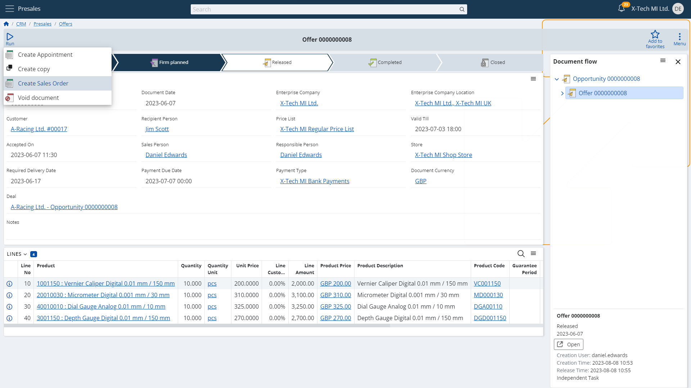

# Run - UI Function

## Overview

Managing documentation these days can be tedious and time-consuming, especially when using software with a more general purpose.  

Many business activities require multiple documents to be created, filled, and connected in a sequence that makes sense when complete. 
Such needs drive companies to look for contemporary and intelligent tools on the market that can take on as much of the administrative efforts as technically possible.  

Utilizing such software in everyday business brings many benefits to it, as the right system can automate a significant portion of the processes related to document fulfillment.  

A boost in productivity and efficiency, an error-free documentation process, automated going through predefined, well-known, and worked-out routes when fulfilling documents - these are only some of the great advantages such platforms have to offer.  

Adding to automation, having an **interactive**, **visually understandable way** of **completing documentation-related actions** leads to a more intuitive and pleasant experience for everyone in your company.  

@@name platform provides a modern, specialized UI functionality that results in faster business operations and ease of making it through the next steps of the document chain you're working on.  

Learn how the **Run UI function** can empower your business to tackle documentation like a winner.  

## Preparing documents in a split second

  

## Connecting records in a meaningful, complete documentation

