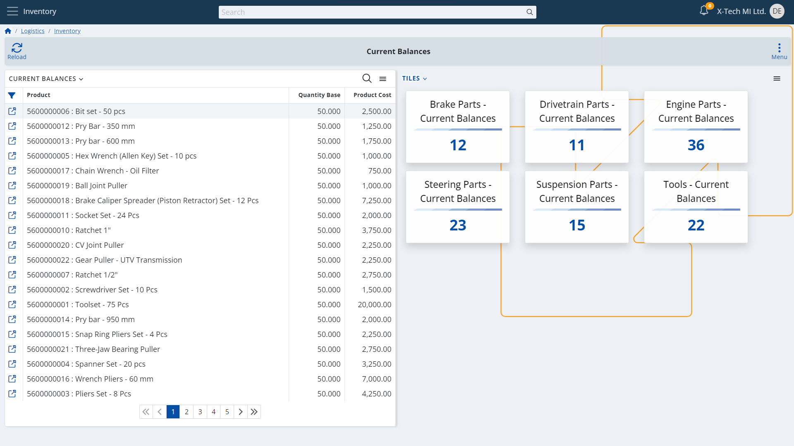

# Tiles Application

## Overview

Information nowadays is everywhere we turn and look. 
And thankfully so, since deep and detailed information is absolutely imperative for performing great with our numerous assignments. 
Hence, it is one of the highest-in-value resources we have at our disposal.  

Growing information can quite overwhelm us, though. 
So many companies, customers, partners, and teams around us means we are constantly operating with more and more data.  

Storing this information in a unified, understandable way in a single, secure place is one thing. 
Finding strictly what we need - now, fast - is another.  

And the more fast-paced our business environment is, the more the importance of quick and suitable access to data becomes. 
Having to navigate back and forth to the same types of data time and again, especially under pressure, can be challenging.  

And this is a challenge that @@name enables you to instantly tackle with its built-in application **Tiles**.  

## Your Data on Focus

Rapidly occurring tasks, speaking with customers and partners, and responding to questions and inquiries all share something in common - the necessity to find what you are looking for and understand it with speed and confidence.  

@@name's Tiles application enables your teams to preview and access information about interesting groups of records neatly organized in tiles. 
Each tile shows a caption and the number of records that will be presented to you when you select it.  

  

> [!TIP]  
> You and your team can create tiles to bring up specific types of records that you will find more valuable.
> This offers you an easy solution to always keep important information one touch away.  

## Let @@name do the navigation for you

@@name's Tiles app lifts repetitive labor off your shoulders, letting you focus more on achieving and less on seeking. 
Enhancing navigation, tiles also act as shortcuts to their related groups of records.  

When set without any filters, tiles can bring up tables of records that you find more important or frequently visit. 
Your system does all the navigation for you in a split second.  

## Leave the heavy lifting to Tiles

Tiles are able to do more than just open these records - they can display specific records that are intended to grab your attention.  

Tiles also store the combination of all the individual filters you set up when creating them. 
Predefined filtering makes them capable of bringing up every time only those records that match your requirements:  

  

This enables your business to save time and speed up progress by staying focused on what is currently important and avoiding distractions.  

## A powerful ally in your everyday business

@@name's Tiles app natively embraces user-friendliness.  
Your teams can create as many tiles of the same table of records as desired, varying only in the defined combination of filters.  

Just as with all the apps in @@name, versatility is a native trait of the Tiles app.  

Tiles can appear wherever you deem fit:  

* Show them on your dashboard to make them visible at first glance  
* Review them in the dedicated Tiles panel of @@name's My Apps collection  
* Display them within any panel, record, or next to any table of records to utilize them as a widget  

## Collaboration is the new norm in business

To ensure your team collaborates effectively, tiles are role-oriented.  

This brings numerous collaboration advantages to your business:  

* Each tile is saved and shows up for a specific role or set of roles  
* The role your users select automatically brings them a collection of tiles with it  
* The people sharing the same role will see exactly the same tiles every time, with any changes applied to them immediately  

Consistency

Widget

> [!TIP]  
> Tiles are extremely user-friendly.
> You can give a suitable name to each one of them, so your teams will know in advance what to expect when viewing and selecting them. 
> You can create tiles for the types of information that you will find most valuable to keep them one touch away.
> You can add frequently 

caption that you can set 

Furthermore, when configuring a tile, all the filters set will be saved in it.  

with predefined filters.  

The app displays tiles neatly organized 

for the frequently access types of records by your teams.  

The Tiles app   in a compact form.  

Acting in the heat of the moment becomes a lot easier, all in 

Arranging all this functionality in a structured, logical manner

To facilitate navigation throughout the platform and to ensure that we view only what is necessary 

logical sense

With so much data that we enter and manage, it 

  
