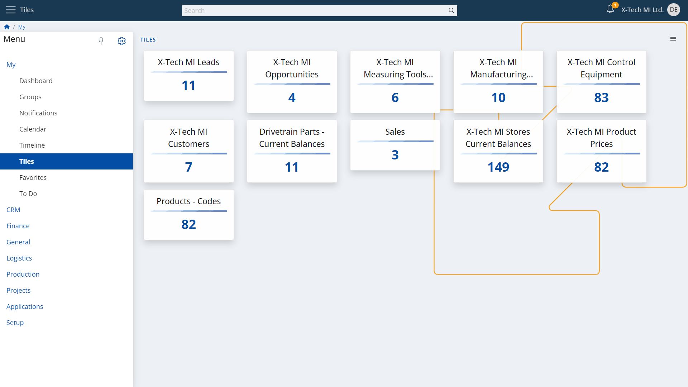
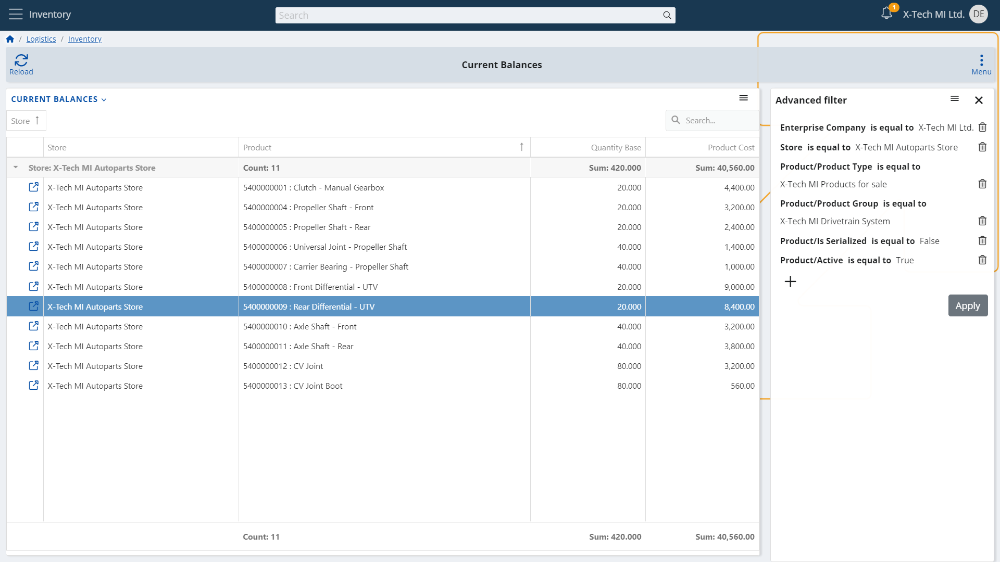

# Tiles Application

## Overview

Information nowadays is everywhere we turn and look. 
And thankfully so, since deep and detailed information is absolutely imperative for performing great with our numerous assignments. 
Hence, it is one of the highest-in-value resources we have at our disposal.  

Growing information can quite overwhelm us, though. 
So many companies, customers, partners, and teams around us means we are constantly operating with more and more data.  

Storing this information in a unified, understandable way in a single, secure place is one thing. 
Finding strictly what we need - now, fast - is another.  

And the more fast-paced our business environment is, the more the importance of quick and suitable access to data becomes. 
Having to navigate back and forth to the same types of data time and again, especially under pressure, can be challenging.  

And this is a challenge that @@name enables you to instantly tackle with its built-in application **Tiles**:  

  

## Your Data on Focus

Rapidly occurring tasks, speaking with customers and partners, and responding to questions and inquiries all share something in common - the necessity to find what you are looking for and understand it with speed and confidence.  

@@name's Tiles application enables your teams to view all desired types of information neatly organized in tiles.  

> [!TIP]  
> You can create tiles for the types of information that you will find most valuable to keep them one touch away.
> You can add frequently

The app displays tiles neatly organized 

for the frequently access types of records by your teams.  

The Tiles app   in a compact form.  

Acting in the heat of the moment becomes a lot easier, all in 

Arranging all this functionality in a structured, logical manner

To facilitate navigation throughout the platform and to ensure that we view only what is necessary 

logical sense

With so much data that we enter and manage, it 

  

